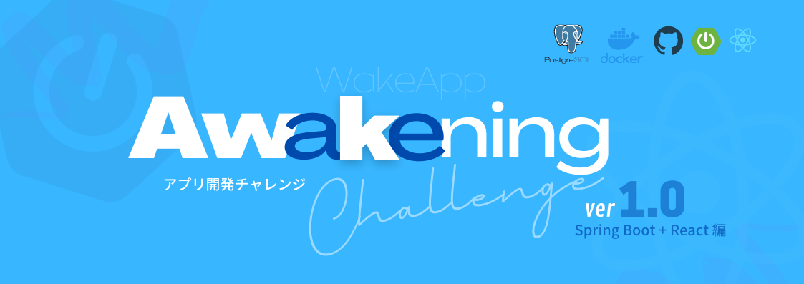

# アプリ開発チャレンジ Awakening 2022 のドラフト案

必要なのはこのチャレンジに手を上げる勇気だけ。

与えられたミッションをこなすことで、作ることが楽しめるエンジニアになる。

## ミッションを通して得られること

- Web アプリ作成に必要となる幅広い知識を、ミッションを通して体験できる
- ミッションを1つずつこなしていくことで、達成感を得られる
- より早くミッションを突破してやろうという「やる気」が生まれる
- 参加メンバ同士、同じミッションを体験することで、共通の話題ができ仲良くなれる
- 失敗しても何度でも立ち上がれる環境が手に入る

## Awakening Challenge とは

Awakening Challenge（アウェイクニング・チャレンジ）とは、翻訳すると「目覚め」のこと。

Awakeninng は、アプリ開発未経験、またはそれに近い人向けのアプリ開発チャレンジプログラム。

次々に突き付けられるミッションをこなして、アプリの完成を目指す。

アプリの完成を達成するまでに、考える力、問題解決能力、Web アプリの開発に必要となる数多くの知識を身に付けることを目的としている。

### ■ Awakening Challenge で身につく3つのスキル

#### 1. 自己解決力:

未知の課題に対して自ら考え、調べて結論を出す力を養う

#### 2. 実践的知識:

精度の高い仮説を立てるための土台となる実践経験を培う

#### 3. コミュニケーション

チームメンバと健全な議論を通じて意思決定の精度を上げる力を育む

---

### ■ 答えを与えるのではなく、答えの探し方を教える場

``` console
人に魚を与えると１日で食べてしまう、しかし人に釣りを教えれば生涯食べていく事が出来る
```
実際の現場で誰かが手取り足取り教えてくれることはありません。Awakeninng Challengeでも、簡単に答えを教えるのではなく、答えの探し方を教えることで、エンジニアとして今後も学び続けるために必要な自己解決能力を育成します。

``` console
人は教えることによって、最もよく学ぶ
```

座学で一方的に教わった内容はすぐに忘れてしまいますが、自分で手を動かして実践し、他の人に自分の言葉で説明できた内容は忘れません。Awakeninng Challengeでは、参加者同士でお互いの考えを話し合い、教え合いながら結論を導くことを通じて、深い学びを得ることを目指します。

---

## ミッション一覧

### ■ 開発環境を構築する

Windows の場合:
- Windows Terminal を winget でインストールする
- Git を winget でインストールする
- Windows Terminal で Git Bash を使えるようにする
- OpenJDK 11 を winget でインストールする
- VSCode を winget でインストールする

macOs の場合:
- Git を HomeBrew でインストールする
- OpenJDK 11 を HomeBrew でインストールする
- VSCode を HomeBrew でインストールする
- VSCode に Java Extension Pack をインスト―ルする
- VSCode を使って Java でコンソールに Hello World を表示する

### ■ GitHub でコードを管理する

- GitHub でアカウントを作成する
- Git コマンドチュートリアル(GCT)をやってみる
GCT でコマンドの素振りを通しで3回ほどやってみる
- GCT をフォークする

Git コマンド チュートリアル:  
https://github.com/fs5013-furi-sutao/git.command.tutorial

### ■ Web ページを表示する

- VSCode に Spring Boot Extension Pack をインストールする
- Gradle で Spring Boot プロジェクトを作成する
- ./gradlew bootRun コマンドを実行してブラウザに Hello World を表示する

### ■ DB に接続する

- ローカルに PostgreSQL をインストールする
- A5M2 をインストールする
- PostgreSQL に DB を作成する
- A5M2 にローカル PostgreSQL のDB を追加する
- DB に employees テーブルを作成する
- employees テーブルに従業員を3人登録する
- ブラウザにランダムで従業員を1人表示する（Spring Data JPA を使う）

### ■ DB を Docker 化する

- Docker Compose で PostgreSQL コンテナを起動する
- A5M2 でコンテナのDBに接続する

### ■ テーブルを作成する

- VSCode で PlantUML を使って ER図を作成する
 氏名、年齢、性別、役職、部署を正規化してテーブル設計する
- DB にテーブルを登録する
- テストデータを作成・登録する
- １つ部署テーブルのデータを削除してみる
- テーブルを順番に drop して全テーブルを削除する

### ■ CRUD アプリを作成する

- 従業員の氏名、年齢、性別、部署、役職を CRUD できるアプリの要望・仕様を明確にする
- Spring Boot で従業員管理システムを作成する
- VSCode の Remote Container 拡張機能でコンテナ開発環境を構築する

### ■ REST API を作成する

- Chrome 拡張機能に Talened API Tester をインストールする
- Spring Boot の RestController を使って従業員情報 REST API を作成する
- Swagger UI を使えるようにする
- フロントエンド（クライアント側）で従業員情報の CRUD ができるようなエンドポイントを作成する

### ■ ユニットテストをやってみる

- Spring Test でテストクラスを作成する
- テスト対象のクラスを作って実行して「テスト駆動開発」を体験する
- カバレッジを見てみる
- DB Unit を使ってリポジトリクラスのテストをしてみる
- Mokit を使って Service と Controller をテストしてみる

### ■ CRUD アプリのフロントエンドを作成する

- React を使って従業員管理システムのフロントエンドを作成する
- Storybook でコンポーネントを開発する
- Cypress を使って E2E テストをやってみる

### ■ デプロイする

- IAMのユーザ、グループ、ロール、ポリシーの違いを説明してみよう

- VPC をマルチ AZ なプライベートサブネット、パブリックサブネットに分けて構築してみよう

- 簡単な冗長化された Web アプリケーションを作ってみよう

- RDS を冗長化してみよう

- AWS に従業員管理システムをデプロイする

### ■ ログイン機能を追加する

- 従業員管理システムにログイン機能を追加する

### ■ CI/CD 環境を構築する

- GitHub Actions によってプッシュをきっかけに自動ビルド、自動テスト、デプロイができるようにする 
